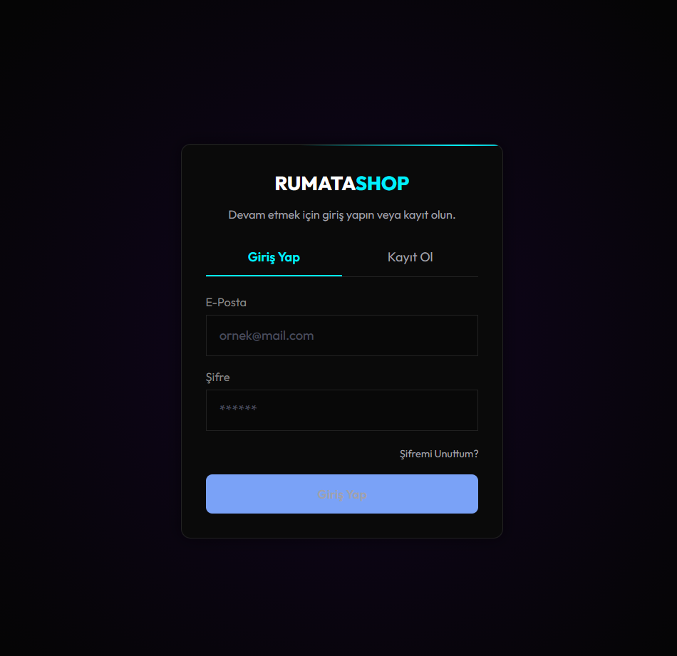
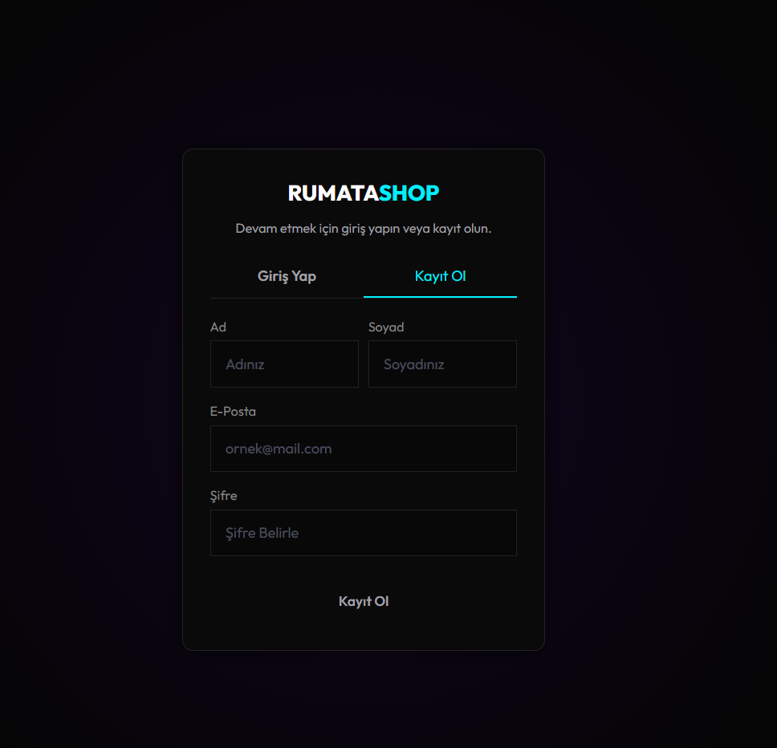
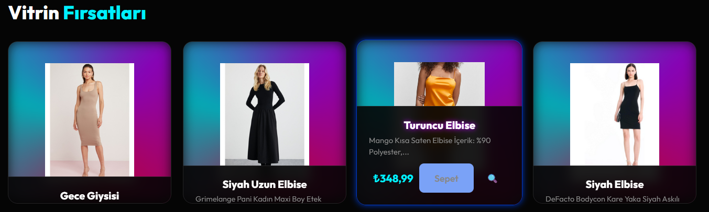
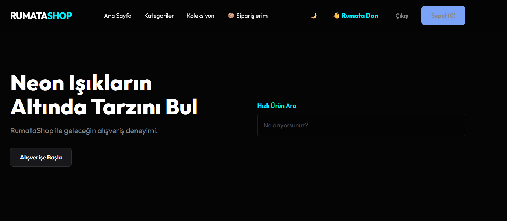

# {RumataShop} Basit Düzey E-Ticaret Sitesi

Bu proje birden fazla **_AI Agentlerını_** kullanarak yapmış olduğum fullstack bir e-ticaret sitesidir.

**Login/Register**

**_Database'e giden şifreler HASH'lenip gitmektedir DB'de ki token sistemi sayesinde kullanıcının mailine giden belli bir süreye ait token kullanımı sonucu şifre değiikliği işlemi gerçekleşmektedir._**

**Ana ekranda Ürün arama seçeneği,**
**Scroll sonrası Ana ekrana dönmek,**
**Siparişlerine gitmek, sepetini kontrol etmek,**
**_hesabından çıkış yapmak ve ürün hakkında detaylı bilgiye sahip olmak isterse diye çeşitli,_**
**_buton ve yazılar yardımıyla kullanıcıyı istediği yere götürecek (next) ve geri dönmesini sağlayacak(prev) seçenekleri vardır._**

**Ürünlerin üzerine gelince bilgilerinin görünmesini sağlayan bir hover sistemi kurulmuştur.**

**_Göze canlı gelmesi ve modern çağa uygun olması açısından cyberpunk teması site geneli tema olarak belirlenmiştir.Kütüphanelerin renk, tema ve boşluklandırma araçları kendi kütüphanelerim kullanılarak yapılmıştır._**

\*\*Kullanılan Teknolojiler\*\*

**AI araçları**

- Gemini 3 Pro
- Claude Sonnet 4.5
- ChatGPT
- Antigravity
- Windsurf

**Kullanılan IDE'ler**

- SSMS 21 (Database)
- Visiual Studio Community 2022 (Backend)
- Visiual Studio Code
- .NET HOST

**Test Edilen Ortamlar**

- Zen Browser (Mozilla)
- Google (Chromium)
- Brave (Chromium)
- FireFox (Mozilla)

**_Kurulum işlemleri proje gelişim sürecinde olduğu için dağıtıma uygun değildir._**

**_Kullanıcının ilk karşısına çıkan ekran Ana sayfadır ürünleri inceler eğer isterse giriş yap butonuna_**
**_tıklayıp sisteme kayıt olabilir veya hesabı varsa giriş yapabilir._**

**_Giriş yaptıktan sonra ihtiyaçlarına göre kategorilendirilmiş ürünleri alıp sepete ekleyip, sipariş verme adımları gerçekleşir._**

**Database Şeması Görseldeki gibidir.**
=> Database View Görseli

**Backend Dosya Hiyerarşisi**
=> Backend Görseli

**Frontend, HTML, CSS, JS ile dinamik, canlı ve hoş site yapısı.**
=> Frontend Görselleri eklenecek
